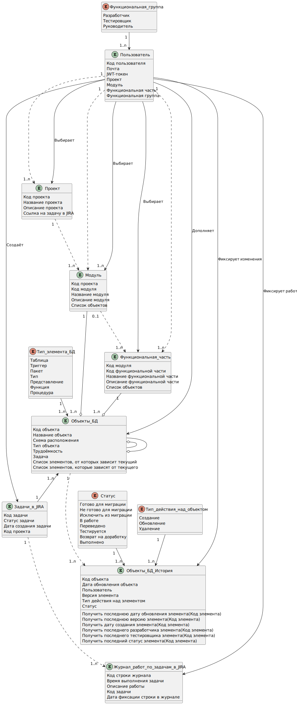

# Информационная модель

## Модель предметной области

В рамках MVP проекта были выделены основные сущности с атрибутами и определены связи между ними.

Базовыми сущностями являются:

- Проект
- Модуль
- Функциональная часть
- Элемент базы данных
- История элемента базы данных
- Пользователь

## Модель данных

