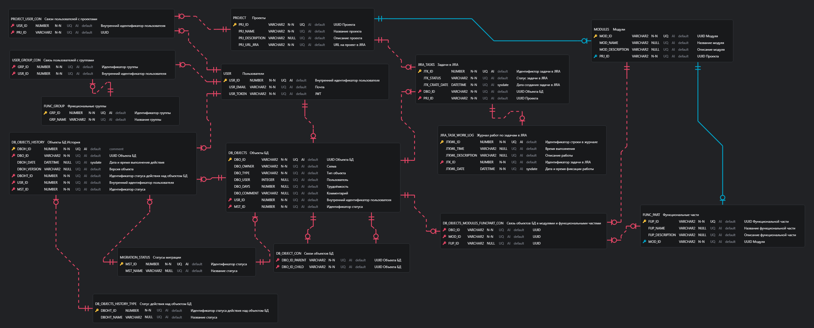

# Информационная модель

## Модель предметной области для сервиса расчёта статистики по процессу миграции 

В рамках MVP проекта были выделены основные сущности с атрибутами и определены связи между ними.

Базовыми сущностями являются:

- Проект
- Модуль
- Функциональная часть
- Элементы серверной части
- История по элементам серверной части
- Элементы клиентской части
- История по элементам клиентской части
- Расширенная история по элементам клиентской части
- Пользователь

```uml
@startuml

Entity Проект{
Код проекта
Название проекта
Описание проекта
}

Entity Модуль{
Код проекта
Код модуля
Название модуля
Описание модуля
Элементы серверной части
Элементы клиентской части
Список привязанных пользователей
}

Entity Функциональная_часть{
Код функциональной части
Код модуля
Название функциональной части
Описание функциональной части
Элементы серверной части
Элементы клиентской части
}

Entity Элементы_Серверной_Части{
Код элемента
Название элемента
Название схемы расположения
Тип элемента в БД
}

Entity История_по_элементам_Серверной_Части{
Версия элемента
Статус
Дата
Прогресс выполнения
}

Entity Задачи{
Код продукта
Код модуля
Код функциональной части
Код задачи
Исполнитель
Заказчик
Статус
}

Entity Связь_задачи_с_частями{
Код задачи
Список элементов серверной части
Список элементов клиентской части
}

Entity История_по_элементам_Клиентской_Части{
Название модуля
Процент перевода
Количество функций на Оракле
Количество функций на ПГ
}

Entity Расширенная_история_по_элементам_Клиентской_Части{
Название пакета
Расположение пакета
Процент перевода пакета
Количество функций пакета на Оракле
Количество функций пакета на ПГ
}

Entity Элементы_Клиентской_Части{
Название JAR
Тип файла
Дата изменения файла
Расположение на FTP
Расположение на SVN
}
enum Тип_файла{
Файл существует
Файл не существует
}

Entity Пользователь{
Код пользователя
Логин
Пароль
Тип пользователя
}

enum Тип_пользователя{
Разработчик
Тестировщик
Руководитель
Администратор
}

enum Тип_элемента_БД {
Таблица
Триггер
Пакет
Тип
Представление
Функция
Процедура
}
Пользователь "1 " -.-> "1..n  " Модуль
Тип_файла "1   " --> "1..n" Элементы_Клиентской_Части
Проект "1  " -.-> "1..n  " Модуль
Модуль "1 " -.-> "1..n  " Функциональная_часть
Модуль "1    " --o "1..n      " Элементы_Серверной_Части
Функциональная_часть "1   " --o "1..n  " Элементы_Серверной_Части
Тип_элемента_БД "1 " --> "1..n  " Элементы_Серверной_Части
Модуль "1" --o "1..n        " Элементы_Клиентской_Части
Элементы_Клиентской_Части "1 " --o "1..n " История_по_элементам_Клиентской_Части
История_по_элементам_Клиентской_Части "1 " --o "1..n " Расширенная_история_по_элементам_Клиентской_Части
Элементы_Серверной_Части "1 " --o "1..n " История_по_элементам_Серверной_Части
Тип_пользователя "1 " --> "1..n " Пользователь

Задачи "1 " --> "1..n " Связь_задачи_с_частями
Связь_задачи_с_частями "1 " --> "        1..n" Элементы_Серверной_Части
Связь_задачи_с_частями "1" --> "1..n   " Элементы_Клиентской_Части
@enduml
```

## Модель данных сервиса расчёта статистики по процессу миграции


## Модель предметной области для сервиса получения данных по процессу миграции объектов БД

В рамках MVP проекта были выделены основные сущности с атрибутами и определены связи между ними.

Базовыми сущностями являются:

- Проект
- Модуль
- Функциональная часть
- Объекты БД
- Объекты БД История
- Задачи в Jira
- Журнал работ по задачам в Jira
- Пользователь

```uml
@startuml
Entity Проект{
Код проекта
Название проекта
Описание проекта
Ссылка на задачу в JIRA
}

Entity Модуль{
Код проекта
Код модуля
Название модуля
Описание модуля
Список объектов
Список привязанных пользователей
}

Entity Функциональная_часть{
Код модуля
Код функциональной части
Название функциональной части
Описание функциональной части
Список объектов
}

Entity Задачи_в_JIRA{
Код задачи
Статус задачи
Дата создания задачи
Код проекта
}

Entity Журнал_работ_по_задачам_в_JIRA{
Код строки журнала
Время выполнения задачи
Описание работы
Код задачи
Дата фиксации строки в журнале
}

Entity Объекты_БД{
Код объекта
Название объекта
Схема расположения
Тип объекта
Трудоёмкость
Задача
Список элементов, от которых зависит текущий
Список элементов, которые зависят от текущего
}

Entity Объекты_БД_История{
Дата обновления объекта
Код пользователя
Версия элемента
Тип действия над элементом
Статус
Получить последнюю дату обновления элемента(Код элемента)
Получить последнюю версию элемента(Код элемента)
Получить дату создания элемента(Код элемента)
Получить последнего разработчика элемента(Код элемента)
Получить последнего тестировщика элемента(Код элемента)
Получить последний статус элемента(Код элемента)
}

Entity Пользователь{
Код пользователя
Почта
JWT-токен
Проект
Модуль
Функциональная часть
Функциональная группа
}

enum Функциональная_группа {
Разработчик
Тестировщик
Руководитель
}

enum Статус {
Готово для миграции
Не готово для миграции
Исключить из миграции
В работе
Переведено
Тестируется
Возврат на доработку
Выполнено
}

enum Тип_элемента_БД {
Таблица
Триггер
Пакет
Тип
Представление
Функция
Процедура
}

enum Тип_действия_над_объектом{
Создание
Обновление
Удаление
}

Проект "1  " -.-> "1..n   " Модуль
Модуль "0..1   " -.-> "1..n  " Функциональная_часть
Модуль "1  " --o "1..n    " Объекты_БД
Функциональная_часть "1   " --o "1..n    " Объекты_БД
Тип_элемента_БД "1 " ---> "    1..n" Объекты_БД
Объекты_БД "1..n   " <-- "1    "  Задачи_в_JIRA
Статус "1  " --> "1..n  " Объекты_БД_История
Объекты_БД "1  " --o "1..n      " Объекты_БД_История
Тип_действия_над_объектом "1     " --> "1..n  " Объекты_БД_История
Объекты_БД o-- Объекты_БД
Объекты_БД --o Объекты_БД
Функциональная_группа "1  " --> "1..n   " Пользователь
Пользователь "1  " -.-> "       1..n" Модуль
Задачи_в_JIRA "1 " -.-> "1..n  " Журнал_работ_по_задачам_в_JIRA
Пользователь "1  " -.-> "1..n " Объекты_БД_История
@enduml
```

## Модель данных сервиса получения данных по процессу миграции объектов БД



## Модель предметной области для сервиса получения данных по процессу миграции Jar

В рамках MVP проекта были выделены основные сущности с атрибутами и определены связи между ними.

Базовыми сущностями являются:

- Модуль
- Элементы клиентской части
- История элементов клиентской части
- Расширенная история элементов клиентской части

```uml
@startuml
Entity Модуль{
Код проекта
Код модуля
Название модуля
Описание модуля
Элементы клиентской части
}

Entity История_по_элементам_Клиентской_Части{
Название модуля
Процент перевода
Количество функций на Оракле
Количество функций на ПГ
}

Entity Расширенная_история_по_элементам_Клиентской_Части{
Название пакета
Расположение пакета
Процент перевода пакета
Количество функций пакета на Оракле
Количество функций пакета на ПГ
}

Entity Элементы_Клиентской_Части{
Название JAR
Тип файла
Дата изменения файла
Расположение на FTP
Расположение на SVN
}
enum Тип_файла{
Файл существует
Файл не существует
}

Тип_файла "1   " --> "1..n" Элементы_Клиентской_Части
Модуль "1" --o "1..n  " Элементы_Клиентской_Части
Элементы_Клиентской_Части "1 " --o "1..n  " История_по_элементам_Клиентской_Части
История_по_элементам_Клиентской_Части "1 " --o "1..n " Расширенная_история_по_элементам_Клиентской_Части
@enduml
```

## Модель данных сервиса получения данных по процессу миграции Jar

