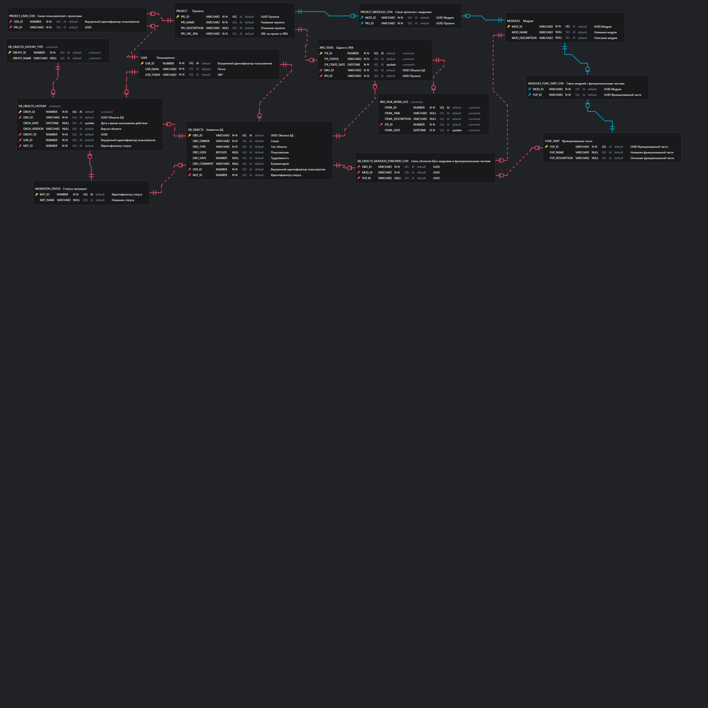

# Информационная модель

## Модель предметной области

В рамках MVP проекта были выделены основные сущности с атрибутами и определены связи между ними.

Базовыми сущностями являются:

- Проект
- Модуль
- Функциональная часть
- Объекты БД
- Объекты БД История
- Задачи в Jira
- Журнал работ по задачам в Jira
- Пользователь

## Модель данных

