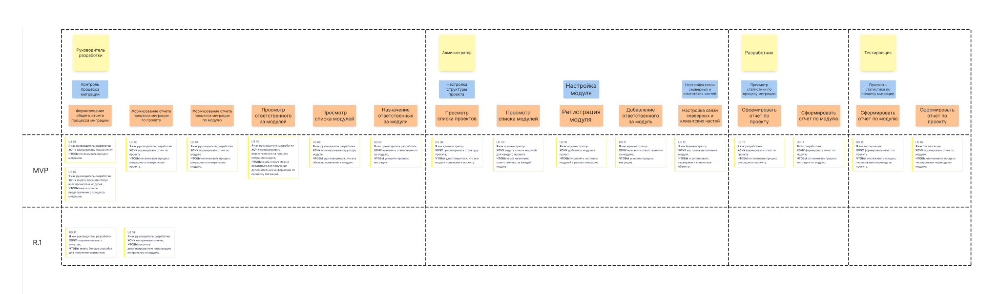
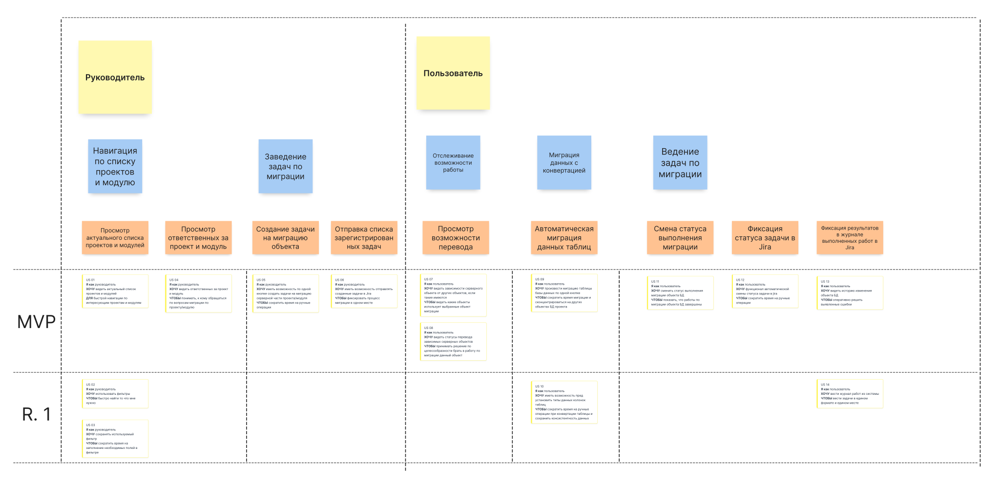
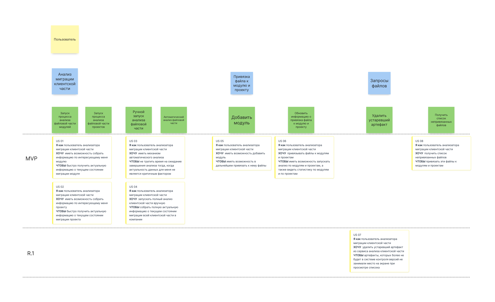

# Требования к системе

## Требования к системе в целом

### Производительность

**`NFPER1`** Система должна обслуживать нем менее 200 пользователей в период пиковой активности с 09:45 до 18:30 по местному времени, со средней продолжительностью сеанса 8 минут.    

**`NFPER2`** Система должна выводить пользователю сообщение о подтверждении в среднем за 3 секунды и не более чем через 6 секунд после того, как пользователь отослал информацию системе.  

### Безопасность

**`NFSEC1`** Система должна предусматривать аутентификацию пользователей в системе по почте и паролю.  

**`NFSEC2`** Пользователи должны обязательно иметь акктивную аутентифицироваться для выполнения любых действий в системе.

**`NFSEC3`** Система должна позволять пользователям просматривать все объекты БД, но редактировать информацию об объектах доступна только группы пользователей, занимающиеся этим проектом.

**`NFSEC4`** Работа внутри сети компании. Работа из внешней источников не предусматривается

### Надежность

**`NFROB1`** Вероятность возникновения критической ошибки должна составлять не более 10% в течении недели.  

**`NFROB2`** Если соединение между системой и сервисами разрывается до того, как пришёл запрос на сбор статистики или при отправки результатов запроса, система должна позволять восстановить незавершенные действия и продолжить работу.

### Доступность

**`NFAVL1`** Допустимое время простоя в сутки не более 30 минут.

### Особенности хранения данных 

**`NFDT1`** История расчёта статистики миграции объектов БД должна храниться 2 года.  

**`NFDT2`** Бекапы БД должны храниться 7 дней с момента создания.

### Концептуальная целостность

**`NFARC1`** Внешние точки входа в систему должны соответствовать архитектурному стилю REST.  

### Поддерживаемость

**`NFSUP1`** Необходимо логировать действия пользователей в системе. Просмотр данных логов должен осуществляться через графический интерфейс. 

**`NFSUP2`** Система должна обеспечивать мониторинг производительности с использованием графического интерфейса.

## Требования к функциям (задачам), выполняемым системой

Система состоит из четырёх сервисов:
 - Сервис аутентификации и авторизации
 - Сервис расчёта статистики по процессу миграции
 - Сервис получения данных по процессу миграции объектов БД
 - Сервис получения данных по процессу миграции Jar

### User Story диаграммы

Основные функции системы представлены в виде User Story диаграмм.

#### **`USSCMS`** User Story по сервису расчёта статистики миграции

#### **`USSDTODB`** User Story по сервису получения данных по процессу миграции объектов БД

#### **`USSDTA`** User Story по сервису получения данных по процессу миграции Jar

