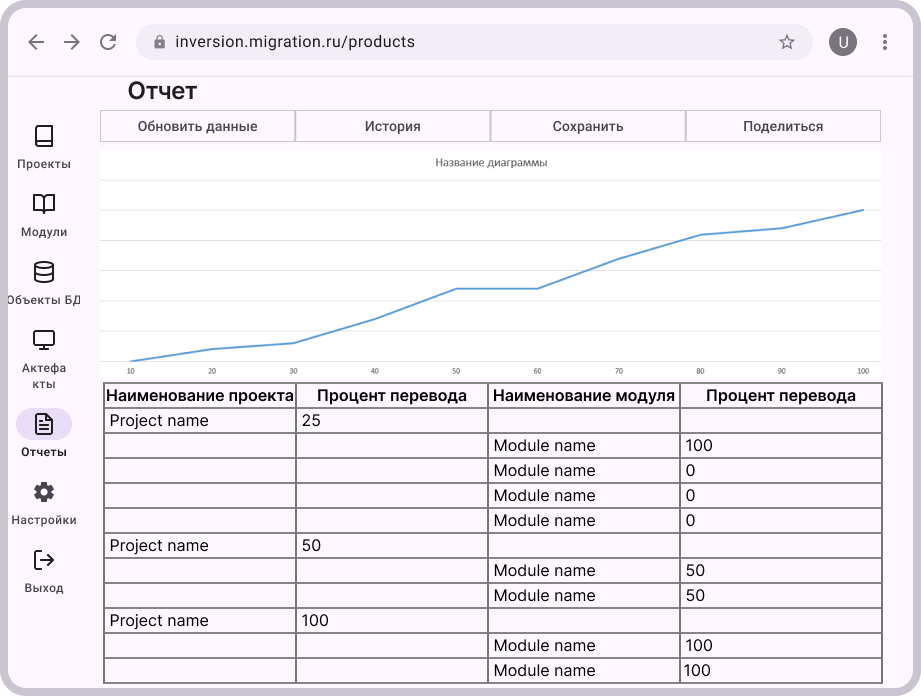

# Пользовательский интерфейс приложения

## Вайрфреймы

Пользовательский интерфейс представлен в виде вайрфоеймов страниц приложения.

### **`WF1`** Форма аутентификации

### **`WF2`** Главная форма

### **`WF3`** Главная форма проекты

### **`WF4`** Модули

### Настройка проектов и модулей

#### **`WF5`** Настройка проектов 

#### **`WF6`** Настройка модулей  

### **`WF7`** Отчёты

### **`WF10`** Форма объектов БД

### **`WF11`** Артефакты

## Прототип приложения

Кликабельный прототип доступен по [ссылке](https://www.figma.com/proto/aQVyvsZ1yDN3ZdWWsGNL1K/Untitled?node-id=1-10020&p=f&t=4qYzgDsQ8jtIlAet-0&scaling=min-zoom&content-scaling=fixed&page-id=0%3A1&starting-point-node-id=1%3A10020)